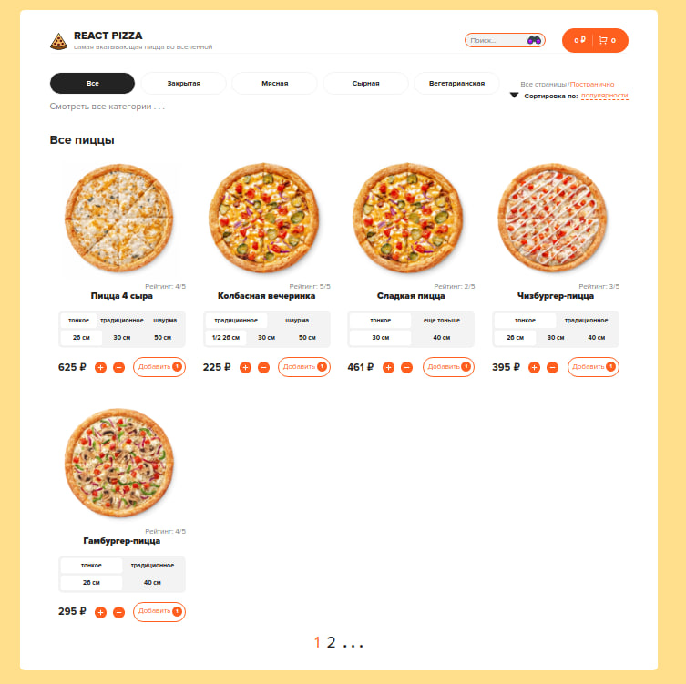

# React pizza - site about pizzas    
 
React pizzas has built on react by using webpack

You can see site on this link - https://reactpizzas.netlify.app/




## Table of Contents

1 [Main Technologies](#Main-Technologies) 
2 [Introduction](#Introduction)
3 [Usage](#Usage)
4 [Run project](#Run-project)
  4.1 [Development](#Development)
    4.1.1 [Middleware](#Middleware)
  4.2 [Production](#Production)
5 [Roadmap](#Roadmap)
6 [License](#License) 
7 [Project status](#Project-status) 


## Main Technologies 

+ Webpack 5.74
+ React 18.2
+ Redux 4.2
+ Redux Toolkit 1.9
+ TypeScript 4.9
+ Cypress 12.2
+ Jest 29.3


## Introduction

*Application has built with webpack*. Were used eslint, stylint, prettier during building project their configs is shown in the project. Data fetching with axios. Sort filters works on the frontend side.

*Added many jest tests for components and a little bit e2e tests*. E2e tests can be run by using script that located on path - ./scripts/run-local-e2e-tests.sh

*Added storybook for component library*. There was added own config for storybook which add supports for scss and module.scss files and also svg as a components.

*Added react route for going through pages without reload*.

*Backend server for pizzas and types(it means meat, cheese or fish and etc.) have located at [this link](https://reactpizzas.ru:5000/)*. You can also see code for backend on [this repository](https://github.com/bot1291/Back-React-Pizza). 

*This application has configured with CI CD by using github actions*. There is check for any linting and types format and then jest and automatic cypress tests. Deployment take place on Netlify, link has introduced above.


## Usage

**In application you can see different pizzas. You can choose whatever you want pizza then go to the cart page and order it.**

 


**Pizza state as a dough or size saves after realoding.** 

 

**You can choose by yourself what you want all pizzas at once or page by page. And also other things that you can check.**

 


## Run project


### Development 

As written above you can run e2e test without needing to start server. For this you should run code below

```
chmod +x scripts/run-local-e2e-tests.sh
```

This will add permision to use this command. And then run tests.

```
./scripts/run-local-e2e-tests.sh
```

#### Middleware

After clone repository you can set husky.
 
```
npm run prepare
```

And then start project locally.

```
npm run dev
```


### Production 

```
npm run build
```

## Roadmap

[ ] Add docker support
[ ] Move sort filters on the backend side


## License

This project is licensed under the terms of the MIT license.


## Project status

Projest building is on active.
